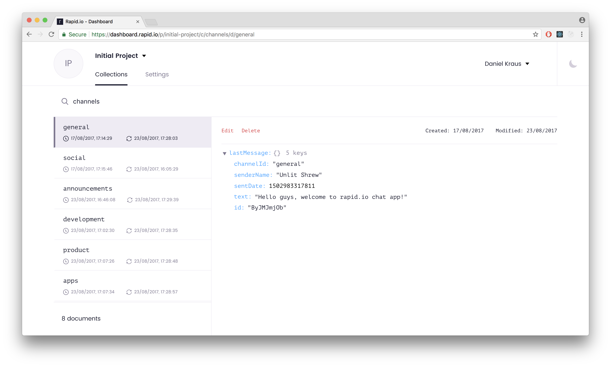

<p align="center">
  
</p>
<hr/>

[](https://github.com/prettier/prettier)

# Chat - Example Web App in Next.js

<p align="center">
  
</p>

## How to use

Clone this repository or download it as a [ZIP](https://github.com/rapid-io/demo-javascript-chat/archive/master.zip)

```
 curl https://codeload.github.com/rapid-io/demo-javascript-chat/tar.gz/master | tar -xz
 cd demo-javascript-chat
```

Visit [http://www.rapid.io](http://www.rapid.io) and create a FREE account. You'll be redirected into Rapid.io Dashboard, where you can find a demo project. Within a Setting tab, you'll find an API key. Copy the key into clipboard, find `lib/rapid.js` file and paste the key to the following constant.

```js
 const API_KEY = ''
```

Install it and run.

```
 yarn
 yarn run dev
```

## Dashboard

In the dashboard, you can observe `channels` collection, that contains documents with channels of your chat app.

<p align="center">
  
</p>

You can also look for `messages` collection and see all documents describing your messages.

<p align="center">
  
</p>


## The idea behind the example

This is a sample chat web app based on [Next.js](https://github.com/zeit/next.js) and [Rapid.io](https://www.rapid.io) real-time database. The app is supposed to showcase usage of [Rapid.io JavaScript SDK](https://github.com/Rapid-SDK/javascript). You can open the app in multiple tabs or windows and start creating channels and posting messages. All the changes are promoted immediately across all clients. Also, try to turn off/on your network connection, do some changes and see how Rapid.io handles all of them.


